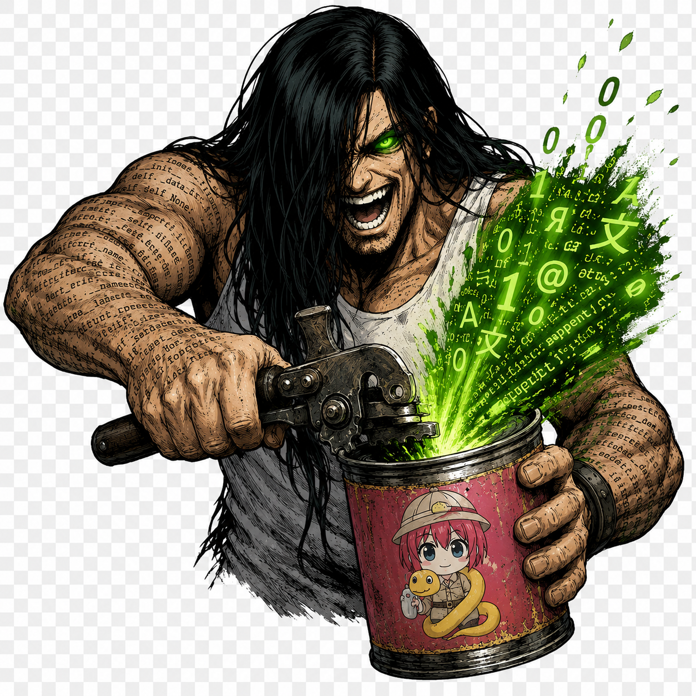

<p align="center">
  
</p>

# 🎮 DeepRenPyTrans

**Tradutor universal para visual novels Ren'Py baseado em Inteligência Artificial.**

🌐 [English](README.md) | [Русский](README.ru.md) | [Español](README.es.md) | [Português](README.pt.md) | [Deutsch](README.de.md) | [Français](README.fr.md) | [简体中文](README.zh.md)

---

Traduza qualquer jogo Ren'Py para qualquer idioma utilizando DeepSeek (incluindo `deepseek-v4-flash` / `deepseek-v4-pro`), OpenAI ou LLMs locais, sem modificar o código-fonte do jogo.

---

## ✨ Recursos

- **🔍 Extração Inteligente** — Encontra automaticamente todas as strings traduzíveis nos arquivos `.rpy`, filtrando código, IDs e mensagens de depuração.
- **🤖 Tradução por IA** — Tradução em lote através de DeepSeek, OpenAI ou Ollama local com contexto contextual da cena/capítulo.
- **🔌 Injeção em Tempo de Execução** — Sistema de ganchos (hooks) com zero modificação nos arquivos do jogo original, utilizando a função nativa do Ren'Py `config.replace_text`.
- **📊 Auditoria de Qualidade** — Encontre strings não traduzidas, traduções órfãs e registros inúteis (junk).
- **🧹 Limpeza de Dicionário** — Remove automaticamente mensagens de depuração, strings de documentação e artefatos de código.
- **⚡ Incremental** — Retoma traduções interrompidas, processando apenas as strings novas ou ausentes.
- **📱 Multiplataforma** — Funciona com versões para PC, Android (injeção em APK) e iOS.

## 🚀 Início Rápido

### 1. Instalar

```bash
git clone https://github.com/Danko-Novak/DeepRenPyTrans.git
cd DeepRenPyTrans

# Opção A: Instalar como um pacote (recomendado: disponibiliza o comando `deeprenpytrans` globalmente)
pip install -e .

# Opção B: Instalar apenas as dependências
pip install -r requirements.txt
```

> Após fazer `pip install -e .` você pode usar o comando `deeprenpytrans` diretamente em vez de `python -m deeprenpytrans`.

### 2. Configurar

```bash
# Copiar as configurações de exemplo
cp .env.example .env
cp config.example.yaml config.yaml

# Edite o arquivo .env com sua chave de API
# Edite o arquivo config.yaml com o caminho do jogo e o idioma de destino
```

Você pode executar a ferramenta de duas maneiras:

#### Opção A: Interface Gráfica Web (Recomendado)
Você pode iniciar o console de três maneiras:
- No Windows: Clique duas vezes no arquivo `run_gui.bat` na pasta raiz do projeto.
- No Linux/macOS: Execute o script shell:
  ```bash
  ./run_gui.sh
  ```
- Ou execute-o manualmente em seu terminal:
  ```bash
  python3 gui_server.py
  ```
Isso abrirá automaticamente o seu navegador em `http://localhost:8000`.

#### Opção B: Interface de Linha de Comando (CLI)
```bash
# Passo 1: Extrair strings do jogo
python -m deeprenpytrans extract --game "./MeuJogo/game"

# Passo 2: Traduzir com IA
python -m deeprenpytrans translate --strings strings_by_file.json --dict "./MeuJogo/game/tl/portuguese/dictionary.json"

# Passo 3: Gerar os ganchos de tempo de execução
python -m deeprenpytrans inject --game "./MeuJogo/game" --lang portuguese
```


## 📖 Comandos

### `extract` — Buscar strings traduzíveis

```bash
python -m deeprenpytrans extract --game ./MeuJogo/game --output strings.json
```

Analisa todos os arquivos `.rpy`, extrai as strings entre aspas e aplica filtros inteligentes para ignorar:
- IDs internos (`ITM_Sword`, `LOC_Bridge`, `ACT_NPC01`)
- Código Python e asserções
- Caminhos de arquivos e códigos de cores hexadecimais
- Mensagens de depuração/registro
- Texto já traduzido (detecção de caracteres do idioma de destino)

Opções:
| Parâmetro | Descrição |
|------|-------------|
| `--game PATH` | Caminho para o diretório `game/` do jogo |
| `--output FILE` | Arquivo JSON de saída (padrão: `strings_by_file.json`) |
| `--include-log PATH` | Mesclar com as strings não traduzidas do `untranslated.log` |

### `translate` — Tradução com IA

```bash
python -m deeprenpytrans translate --strings strings.json --dict dictionary.json
```

Envia as strings para a API de IA em lotes inteligentes (agrupados por arquivo de origem para manter o contexto).
Suporta tradução incremental: strings já traduzidas são ignoradas automaticamente.

### `audit` — Controle de qualidade

```bash
python -m deeprenpytrans audit --dict dictionary.json --strings strings.json
```

Gera um relatório detalhado mostrando:
- ❌ Strings não traduzidas (presentes no código, mas não no dicionário)
- 👻 Traduções órfãs (presentes no dicionário, mas não existem mais no código)
- 🔁 Chaves e valores idênticos (possivelmente ignorados na tradução)
- 📭 Traduções vazias
- 🗑️ Registros inúteis/junk (mensagens de depuração, fragmentos de código)

### `clean` — Limpeza do dicionário

```bash
python -m deeprenpytrans clean --dict dictionary.json --dry-run
python -m deeprenpytrans clean --dict dictionary.json --remove-orphaned
```

Opções:
| Parâmetro | Descrição |
|------|-------------|
| `--dry-run` | Visualização prévia do que seria removido |
| `--keep-junk` | Não remover strings de depuração/código |
| `--remove-orphaned` | Remover também as traduções que já não existem no código |

### `inject` — Gerar hooks.rpy

```bash
python -m deeprenpytrans inject --game ./MeuJogo/game --lang portuguese
```

Gera um arquivo `hooks.rpy` que:
- Carrega o arquivo `dictionary.json` ao iniciar o jogo.
- Intercepta todo o texto na tela usando `config.replace_text`.
- Salva as strings não traduzidas em `untranslated.log` em tempo real enquanto você joga.
- Adiciona uma tecla de atalho para ativar/desativar a tradução ao vivo.
- Substitui as fontes originais por tipografias compatíveis com o idioma de destino.

## ⚙️ Configuração

### `config.yaml`

```yaml
game_dir: "./MeuJogo/game"
target_language: "Portuguese"
translation_dir: "portuguese"

api:
  provider: "deepseek"    # ou "openai", "openrouter", "groq", "nebius", "deepinfra", "gemini", "dashscope", "ollama"
  model: "deepseek-chat"  # suporta novos modelos deepseek-v4-flash / deepseek-v4-pro
  temperature: 0.2
  batch_size: 40

fonts:
  default: "DejaVuSans.ttf"
  replacements:
    "OriginalFont.ttf": "DejaVuSans.ttf"

extraction:
  skip_prefixes: ["ITM", "ACT", "LOC", "QST"]
  force_include: ["Q.Save", "Q.Load"]
```

### `.env`

```bash
DEEPSEEK_API_KEY=sk-sua-chave-aqui
# ou
OPENAI_API_KEY=sk-sua-chave-openai-aqui
```

> [!NOTE]
> O suporte para modelos locais (Ollama) e provedores de API alternativos (OpenAI, OpenRouter, Groq, Nebius, DeepInfra, Gemini, DashScope) além do DeepSeek é atualmente nominal. A ferramenta foi otimizada originalmente para o DeepSeek, e as outras integrações foram implementadas seguindo os padrões oficiais da API OpenAI sem testes exaustivos. A lista de provedores e chaves totalmente verificados será expandida em atualizações futuras.


## 🏗️ Como Funciona

```
┌────────────────┐     ┌──────────────┐     ┌────────────────┐
│ Arquivos .rpy  │────▶│  Extractor   │────▶│  strings.json  │
│ (código jogo)  │     │  (filtros)   │     │ (por arquivos) │
└────────────────┘     └──────────────┘     └───────┬────────┘
                                                    │
                                                    ▼
┌────────────────┐     ┌──────────────┐     ┌────────────────┐
│  Dicionário    │◀────│ Tradutor IA  │◀────│ Provedor API   │
│     .json      │     │   (lotes)    │     │ (DeepSeek/etc) │
└───────┬────────┘     └──────────────┘     └────────────────┘
        │
        ▼
┌────────────────┐     ┌──────────────┐
│   hooks.rpy    │────▶│ Jogo Ren'Py  │ ← O jogador vê o texto traduzido!
│  (execução)    │     │ (execução)   │
└────────────────┘     └──────────────┘
```

## 📱 Implantação em Dispositivos Móveis

### Android (Injeção em APK)
1. Utilize o nosso script de compilação automatizado (`build_apk.bat` para Windows ou `android/build_apk.sh` para Linux/macOS) que realiza todo o processo:
   - Extrai os recursos do jogo do APK antigo.
   - Restaura os recursos já comprimidos do APK original para economizar até 60% do tamanho total (economia média de ~400-500 MB).
   - Realiza a conversão de áudio wav para ogg.
   - Otimiza as novas imagens para dispositivos móveis, ignorando as que já estavam compactadas.
   - Compacta o APK usando compactação ultra e o assina de forma automática.
2. **Personalização**: Você pode personalizar o processo de compilação editando os sinalizadores (flags) no topo do script de compilação (`build_apk.bat` ou `android/build_apk.sh`):
   - `RESTORE_OLD_ASSETS` (1/0): Habilitar/desabilitar a restauração de recursos já comprimidos do APK antigo.
   - `COMPRESS_AUDIO` (1/0): Habilitar/deshabilitar a conversão de wav para ogg e a correção dos caminhos nos scripts.
   - `COMPRESS_IMAGES` (1/0): Habilitar/deshabilitar a compactação de novas imagens.
   - `INJECT_TRANSLATION` (1/0): Habilitar/deshabilitar a injeção da tradução. Defina como `0` para compilar um port limpo sem tradução (no idioma original).
   - `LANG_FOLDER`: Nome da pasta de idioma de destino dentro de `game/tl/` (por exemplo, `portuguese`).
   - `COMPRESSION_LEVEL` (0-9): Nível de compactação do 7-Zip (9 = compactação ultra, 0 = sem compactação).
3. Se fizer manualmente: descompacte o APK, substitua os arquivos dentro de `assets/x-game/game/`, limpe as assinaturas em `META-INF/` e volte a compactar e assinar.

### iOS
1. Gere o projeto Xcode a partir do Ren'Py Launcher.
2. Adicione a pasta `tl/portuguese/` ao projeto.
3. Compile e instale no dispositivo.
## ⚠️ Nota Importante e Limitações

- **Status de Testes**: Até o momento, esta ferramenta foi testada e verificada em apenas um jogo, onde tudo foi traduzido e compilado corretamente.
- **Código Específico do Jogo**: Embora o objetivo tenha sido criar uma ferramenta de tradução universal perfeita, outros jogos Ren'Py podem (e provavelmente vão) exigir alguns ajustes para se adaptarem à sua base de código específica, prefixos personalizados ou particularidades de script.
- **Não sabe programar?**: Se você não sabe programar ou está com preguiça de modificar os scripts, recomendamos fortemente o uso de assistentes de programação baseados em IA, como **Antigravity**, **Cursor** ou ferramentas semelhantes, para ajudar você a adaptar o extrator e os filtros para o seu jogo específico.

## 🤝 Contribuir

Toda contribuição é bem-vinda! Áreas em que você pode ajudar:
- Integração de novos provedores de LLM.
- Suporte e testes para idiomas CJK (chinês, japonês, coreano).
- Melhoria dos heurísticos de extração de texto para jogos complexos.

## 🗺️ Cronograma e Recursos

Acompanhamos o nosso desenvolvimento, planejamos novos recursos e priorizamos as tarefas com base no feedback da comunidade. Se você tiver uma ideia ou quiser solicitar um recurso, acesse a aba **Discussions** (Discussões) no GitHub, envie sua proposta ou vote nas ideias existentes!

| Recurso | Votos | Status | Progresso |
| :--- | :--- | :--- | :--- |
| **Console Web GUI (Dashboard)** | - | 🚀 Lançado | `[████████████████████]` 100% |
| **Empacotador e Otimizador de APK** | - | 🚀 Lançado | `[████████████████████]` 100% |
| **Suporte a LLMs Locais e Ollama** | - | 🚀 Lançado | `[████████████████████]` 100% |
| **Suporte para macOS e Linux** | - | 🚀 Lançado | `[████████████████████]` 100% |
| **Auditoria de Tradução CJK** | 0 | 📋 Planejado | `[█░░░░░░░░░░░░░░░░░░░]` 5% |

---

## 💖 Apoie o Projeto

O DeepRenPyTrans é um projeto desenvolvido com paixão para simplificar o processo de tradução de novelas visuais. Se esta ferramenta economizou seu tempo ou ajudou a levar um jogo para um novo público, considere apoiar seu desenvolvimento.

Atualmente estou usando uma estação de desenvolvimento básica e pretendo atualizá-la para uma estação de trabalho dedicada a IA local executando Linux com ROCm. Isso permitirá testes nativos e em alta velocidade de LLMs locais.

**Meta de Arrecadação:** 0 / 1.200 USD

### 🚀 Tiers de Upgrade:
* **Tier 1: Upgrade de GPU ($850)** — Compra de uma GPU AMD Radeon de 24GB (ex: RX 7900 XTX ou equivalente da próxima geração) para rodar localmente LLMs grandes (como modelos 14B/32B/70B) sob Linux ROCm.
* **Tier 2: Upgrade de Armazenamento ($150)** — Upgrade para um SSD NVMe PCIe 4.0 rápido de 2TB. Os modelos LLM locais exigem muito espaço em disco (de 5GB a mais de 40GB+ por modelo), e meu SSD atual de 500GB está cheio.
* **Tier 3: Upgrade de RAM ($150)** — Adicionar mais 32GB de RAM (para um total de 64GB) para permitir fluxos de trabalho paralelos, multitarefa intensiva em IDE e descarregamento de modelos no CPU.
* **Gastos recorrentes: Fundo de API ($50)** — Pequeno orçamento para testar APIs comerciais (DeepSeek, OpenAI, Claude) durante os testes de tradução.

### Como ajudar:
* **Dar uma estrela no repositório (Star):** Ajuda na visibilidade do projeto e me motiva a continuar programando!
* **Contribuir:** Abra issues, sugira recursos ou envie um PR.
* **Doar (USDT - TON / Rede TON):**
  `UQBdHUyR8nG5p_Rwhw_Rtmgc7QJdJ-G5nOPJa7Pq0mh2A27K`

## 📄 Licencia

GNU AGPL v3 — veja o arquivo [LICENSE](LICENSE) para mais detalhes.
